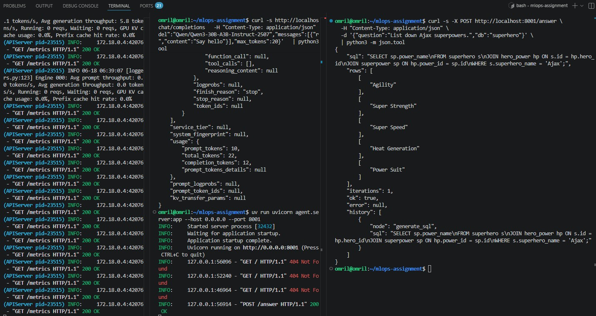
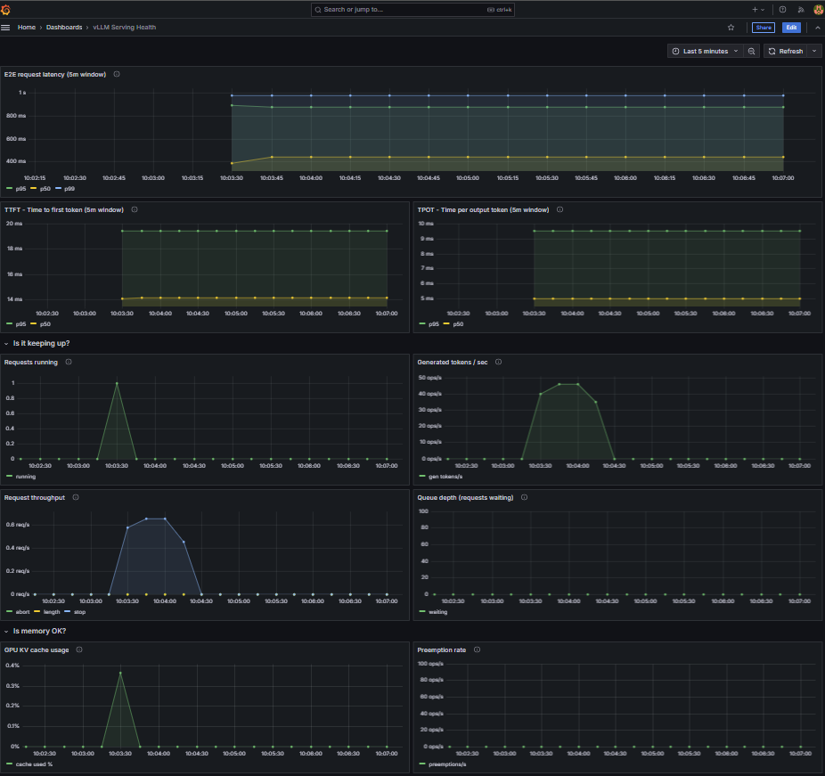
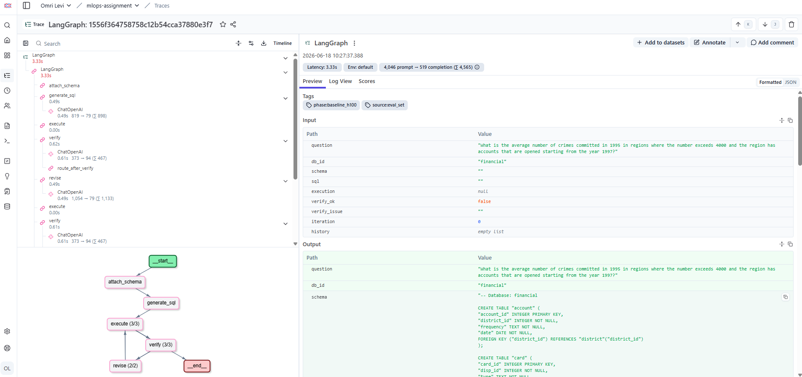
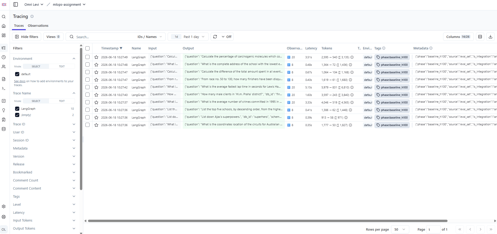
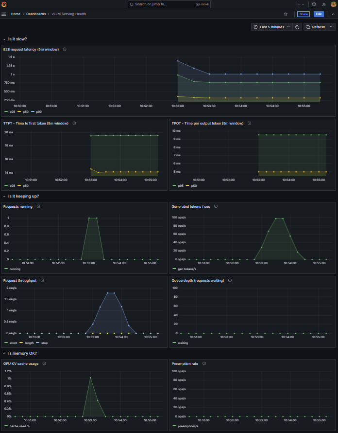
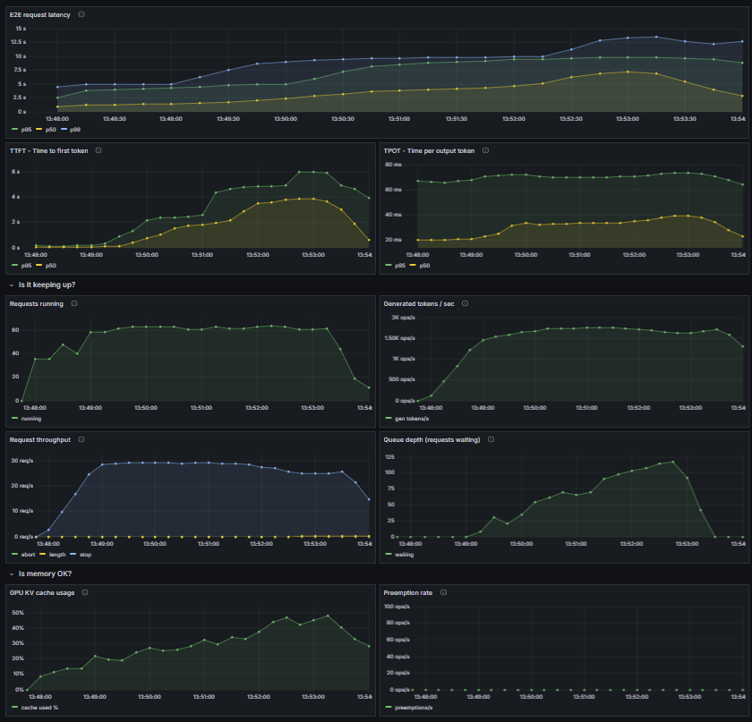
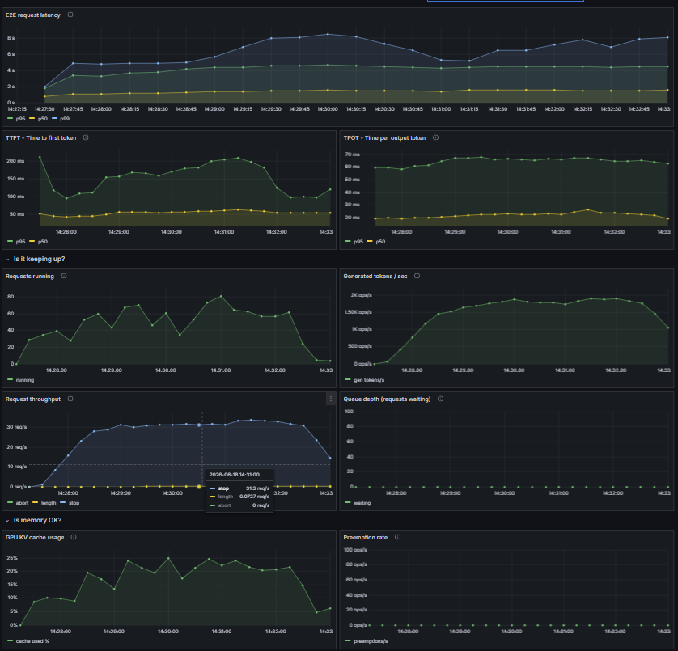

# MLOps Assignment Report

---

## Phase 1 - Serving Configuration

**Local development:** Nebius Token Factory API (OpenAI-compatible endpoint)
using `Qwen/Qwen3-30B-A3B-Instruct-2507` as a hosted backend.

**Production target:** vLLM on 1× H100 80GB.

### Initial vLLM flags (H100 configuration — `scripts/start_vllm.sh`)

| Flag | Value | Reason(s) |
|---|---|---|
| `--dtype` | `bfloat16` | Model weights are released in bfloat16. Loading in the same dtype avoids any precision conversion. In addition, H100 has native bfloat16 tensor cores. Using fp32 would double weight memory with no quality benefit since the weights were never fp32 to begin with. |
| `--max-model-len` | `8192` | This flag rules the model context length (prompts + output). We assume (by experiment) that our prompt + output will not exceed this length. Capping context frees KV cache headroom for concurrency. |
| `--gpu-memory-utilization` | `0.92` | Leaves ~6GB headroom for model weights; gives KV cache maximum VRAM.<br>Higher value would give more KV cache blocks and therefore higher throughput. Lower value would give less KV cache blocks which reduces throughput. |
| `--max-num-seqs` | `64` | Initial value of 64 chosen as a conservative starting point for H100; MoE architecture reduces per-token compute cost, suggesting higher concurrency is viable. If KV cache is not fully utilized, this value can be increased. |
| `--enable-prefix-caching` | on | Every query against the same DB shares an identical schema preamble, therefore avoid re-prefilling those tokens on each request. Should drop TTFT since the schema is already cached. |
| `--enable-chunked-prefill` | on | Prevents long schema prefills from blocking decode steps of concurrent requests. Should prevent spikes in TPOT for all concurrent requests whenever a new one arrives. TTFT can be slightly higher. |
| `--trust-remote-code` | on | Required for Qwen3 from HuggingFace |
| `--disable-log-requests` | on | Removes per-request stdout overhead under load. Otherwise adds latency and CPU overhead. |


### Manual query results (5 questions from `evals/eval_set.jsonl`)

Schema was injected at runtime via `render_schema()` which reads real CREATE TABLE
statements directly from the SQLite files.

| # | Question | DB | Outcome | Notes |
|---|---|---|---|---|
| 1 | Australian GP coordinates | formula_1 | Near-correct | Missing `DISTINCT` → 11 duplicate rows instead of 1 |
| 2 | Ajax superpowers | superhero | Correct | 5 rows returned, matches gold |
| 3 | Top 5 schools by enrollment | california_schools | Correct | Correct JOIN and ORDER BY |
| 4 | Average crimes 1995 | financial | Wrong | Used `A14` instead of `A15` → returned NULL |
| 5 | Male clients in Praha | financial | Wrong | Used lowercase `'m'` instead of `'M'` → returned 0 instead of 339 |

**Key observations:**

3/5 queries correct or near-correct with schema injection. Two failure modes
worth noting:

- **NULL result (Q4):** model picked the wrong column (`A14` vs `A15`). A verify
  node should flag a NULL aggregate as implausible.
- **Zero rows (Q5):** case-sensitive string comparison (`'m'` vs `'M'`) returned
  0 when rows clearly exist. Zero rows on a counting question is a strong signal
  for the verifier to trigger a revise.
- **Duplicate rows (Q1):** missing `DISTINCT` returns 11 identical coordinate
  pairs. Also detectable since 11 rows all identical is suspicious for a coordinates
  lookup.

All three failure modes are detectable signals the verify node can act on,
which directly motivates the agent loop in Phase 3.

### Screenshot - vllm manual query example



---

## Phase 2: Observability Dashboard

The dashboard is organized around three questions a person on call needs to answer immediately:<br>
**1. Is the system slow?**<br>
**2. Is it keeping up?** <br>
**3. Is memory OK?**<br>

---

### Why these specific metrics

#### Latency (or "Is it slow?")

Three panels: E2E latency (P50/P95/P99), TTFT, TPOT. E2E here is **per-LLM-call** as seen by vLLM, not full agent latency - the SLO spans 2–3 of these calls sequentially.

- E2E ≈ TTFT + (output_tokens × TPOT). 
- TTFT (time to first token) captures prefill cost and queue wait. 
- TPOT (time per output token) captures decode speed. 

When E2E is high: 
- if TTFT high → requests are queuing or prefill is slow, check queue depth. 
- if TPOT high → decode batch is too large, check requests running; 
- if P99 spikes with P95 fine → check preemption rate.

#### Throughput (or "Is it keeping up?")

Four panels: requests running, generated tokens/sec, request throughput (req/s), queue depth.

- Requests running and generated tokens/sec give context on what the system is actually doing at that moment.
- Queue depth (`num_requests_waiting`) is the most actionable metric: if it grows, arrival rate exceeds serving rate. Check whether the ceiling is compute (TPOT rising) or the scheduler cap (`--max-num-seqs`). 
- Request throughput gives achieved RPS to compare against the load test target.

#### KV Cache (or "Is memory OK?")

Two panels: GPU KV cache usage (%), preemption rate.

- KV cache usage shows available headroom. If cache approaches 100%: reduce `--max-num-seqs` or `--max-model-len`.
- Preemption rate is the alarm: nonzero means the cache ran out and vLLM is evicting and recomputing sequences, which shows up directly as P99 spikes in the latency panel.

---

### Screenshot - grafana serving

Full dashboard reacting to a burst of requests on H100.


---

## Phase 3 — Agent

The agent implements a generate → execute → verify → (revise) loop using LangGraph. The graph has four nodes:

- **generate_sql**: given the schema and question, produces an initial SQL query (vLLM call #1)
- **execute**: runs the SQL against the SQLite DB and returns rows or an error (provided)
- **verify**: given the question, SQL, and result, decides whether the result plausibly answers the question and if not, describes the specific problem (vLLM call #2)
- **revise**: given the identified problem, the original SQL, the result, and the schema, surgically fixes the failing fragment (vLLM call #3, only when verify returns ok=false)

The loop is capped at 3 total iterations. `route_after_verify` returns `"revise"` when verify outputs `ok=false` and the iteration count is below the cap, and `"end"` otherwise.

By setting max iterations to 3, the maximum number of vLLM calls per question can be 6 (1: generate + verify, 2: revise + verify, 3: revise + verify).

---

## Phase 4 — Agent Observability

Langfuse wired via `langfuse.langchain.CallbackHandler` passed as a callback on each `graph.invoke`. Each agent run produces a root trace with nested spans for `generate_sql`, `verify`, and `revise` (when triggered), each showing prompt, response, latency, and token counts. Traces tagged with `phase` and `source` keys for filtering by experiment.

#### Screenshots - langfuse
- langfuse trace: shows a single agent run with a revise iteration triggered by verify<br>
 
- langfuse tags: shows filtering by `phase=baseline` and `source=agent` to analyze only the agent runs from the baseline experiment.


---

## Phase 5 — Evals

Execution accuracy: compare canonicalized row sets (sorted, stringified) from agent SQL vs gold SQL. Per-iteration pass rate uses carry-forward, i.e. if agent stopped at iteration j, that result fills all later slots.

### Baseline results (`results/eval_baseline.json`)

| Metric | Value |
|---|---|
| iter_1 pass rate | 26.67% |
| iter_2 pass rate | 30.00% |
| iter_3 pass rate (overall) | **30.00%** |
| Revise triggered | 11/30 (36.67%) |
| Avg iterations | 1.63 |

The revise loop recovered 3.33% (iter_1 26.67% → iter_3 30%), meaning the loop is doing real work.

#### Screenshot - grafana dashboard during baseline eval


---

## Phase 6 — SLO

**Target: P95 end-to-end agent latency < 5 seconds at 10+ RPS sustained over 5 minutes.**

### Iteration log

| Version | Changed | <div style="width:200px">Saw<br>(After change)</div> | Hypothesized<br>(why? + what to change?) | Targeted metric | E2E followed? | Keep the change? |
|---|---|---|---|---|---|---|
| **V0** baseline | — | **Timeout rate: 54% ❌**<br>single call:<br>E2E p95: ~3.6s <br>TTFT p95: 215ms<br>TPOT p95: 55ms<br>Requests running: up to 25<br>Queue: 0<br>KV cache: 0-30% | Server capacity is limited, vLLM is idle, need to increase number of workers. | Reduce timeouts rate to ~0% | 116s |  |
| **V1** | workers 1→32 | Timeouts rate - 0.8% ✅<br>single call:<br>E2E p95: ~8.5s ❌<br>TTFT p95: ~4.8s ❌<br>TPOT p95: 70ms<br>Requests running: up to 64<br>**Queue: 0→120→0** ❌<br>KV cache: 0-48% | Queue is now the bottleneck (requests waiting). Reducing `max-model-len` should make more space to fit more requests. | Reduce queue depth (requests waitings). | ✅ 116→88s | Yes |
| **V2** | max-model-len 8192→4096 | single call:<br>E2E p95: ~5.5s ⬇️<br>TTFT p95: ~2.4s ⬇️<br>TPOT p95: 70ms<br>Requests running: up to 64<br>Queue: 0→66→0 ⬇️<br>KV cache: 0-25%⬇️ | Freeing KV blocks improves throughput as well as TTFT (cut by half). TTFT is still high, trying to quantize the model to 8-bit could help to make faster calculations -> prefill and decode. | Cut TTFT by half | ✅ 88s→34s | Yes |
| **V3** | +fp8 quantization | single call:<br>E2E p95: 8-10s ⬆️❌<br>TTFT p95: ~2.5-5s ⬆️❌<br>TPOT p95: 70ms<br>Requests running: up to 64<br>**Queue: 0→111→0**⬆️ ❌<br>KV cache: 0-48%⬆️ | TTFT worsened to 5s, queue 66→111, we didn't address the correct issue ❌<br>The right flag to decrease the queue depth which will lead to lower TTFT is increasing `max-num-seqs` | Reduce queue depth to 0 (no waiting requests) | ❌ 34s→44.5s | No |
| **V4** | max-num-seqs 64→128 | single call:<br>E2E p95: 4.5s ⬇️<br>TTFT p95: 100-200ms ⬇️<br>TPOT p95: 70ms<br>Requests running: up to 81<br>**Queue: 0**⬇️<br>KV cache: 0-25%⬇️ | doubling scheduler slots drains queue; KV headroom exists | TTFT 2.4s→100ms-200ms ✅, queue→0 ✅ | ✅ 34s→19.8s | Yes |

### Final configuration

```bash
--dtype bfloat16
--max-model-len 4096        # V2: frees KV cache per slot
--gpu-memory-utilization 0.92
--max-num-seqs 128          # V4: doubled from 64, queue eliminated
--enable-chunked-prefill
--enable-prefix-caching
--trust-remote-code
--disable-log-requests
```

also added --workers 32 to server call:

`uv run uvicorn agent.server:app --host 0.0.0.0 --port 8001 --workers 32`

### Screenshots - grafana dashboards before (V1) and after (V4) tuning
I add here below grafana screenshots for the "before" and "after" tuning phases. We refer to V1 as "before" since it's the first configuration that can handle the load without timeouts, and V4 as "after" since it's the final configuration I had time to implement with the best latency results.
| Before (V1) | After (V4) |
|---|---|
|  |  |

### SLO Honest verdict

**SLO missed.** Best achieved: agent P95=19.8s vs 5s target at 10 RPS.

vLLM is in a healthy state in the final configuration: queue=0, TTFT p95=160ms-200ms, no preemptions. The gap is in per-call decode latency. Breaking down a single LLM call at p95: TTFT accounts for 160ms and decode accounts for 62 output tokens × 70ms TPOT = 4.34s — totaling ~4.5s per call. Most of the per-call latency is in the decode phase.

With 2 sequential calls per agent on the common path (generate + verify), the minimum agent E2E at p95 is 2 × 4.5s = 9s — already 1.8× the SLO before any overhead. To close the gap on the 2-call path, TPOT would need to fall from ~70ms to ~38ms per token.

---

## Phase 7 — Agent Value and Next Steps

### Did the agent loop help?

Yes. The per-iteration pass rate at baseline shows iter_1=26.67% rising to iter_3=30.00%, so the revise loop recovered 3.33% points. 11 of 30 questions (37%) triggered at least one revise call, and 1 in 3 of those recovered a correct answer. The loop is earning its keep on the failure modes it was designed for. After load tuning, quality improved further to 33.33% overall (iter_1=30%, iter_3=33.33%), confirming that the latency optimizations did not regress correctness:

| Metric | Baseline | After tuning |
|---|---|---|
| iter_1 pass rate | 26.67% | 30.00% |
| iter_2 pass rate | 30.00% | 33.33% |
| iter_3 pass rate (overall) | 30.00% | 33.33% |
| Revise triggered | 11/30 (36.67%) | 11/30 (36.67%) |
| Avg iterations | 1.63 | 1.63 |

### What I'd do with more time

1. **KV cache quantization** - `--kv-cache-dtype fp8` quantizes the KV cache (separate from weight quantization, so no MoE routing overhead). Decode on H100 is memory-bandwidth-bound: each decode step reads the full KV cache for every active token. Halving the KV cache size per token halves that bandwidth pressure, which directly reduces TPOT. This is the most targeted lever available against the 70ms/token bottleneck, without touching model weights or accuracy.

2. **Schema summarization** - schema prompts for wide tables can exceed max-model-len. A lightweight pre-processing step that filters the schema to only tables and columns relevant to the question (heuristic) would eliminate those truncation failures and reduce prompt length, cutting TTFT for every request.
